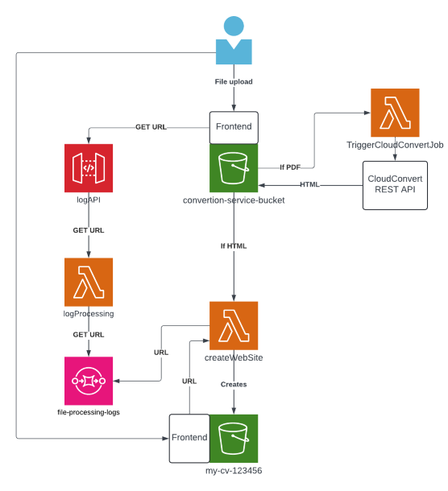
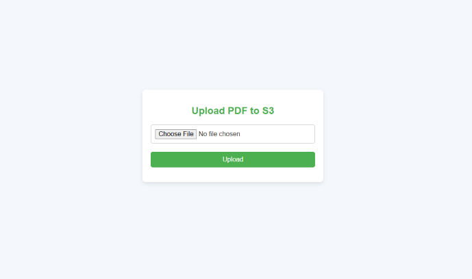
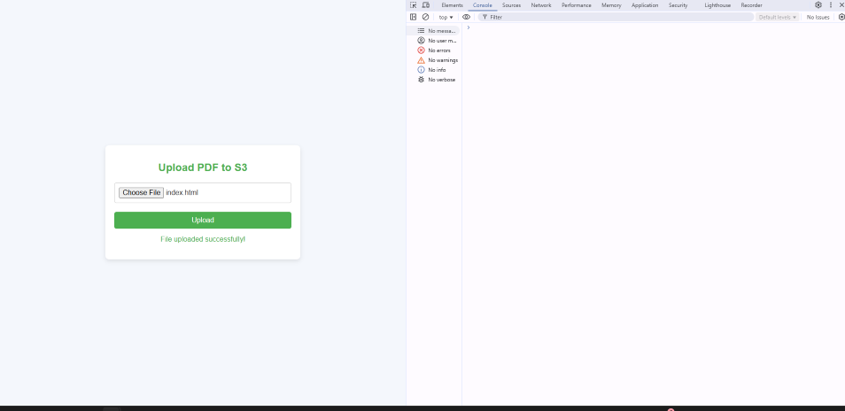
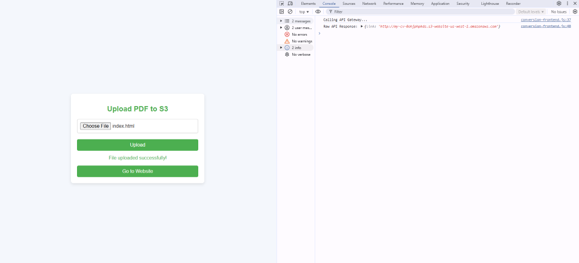
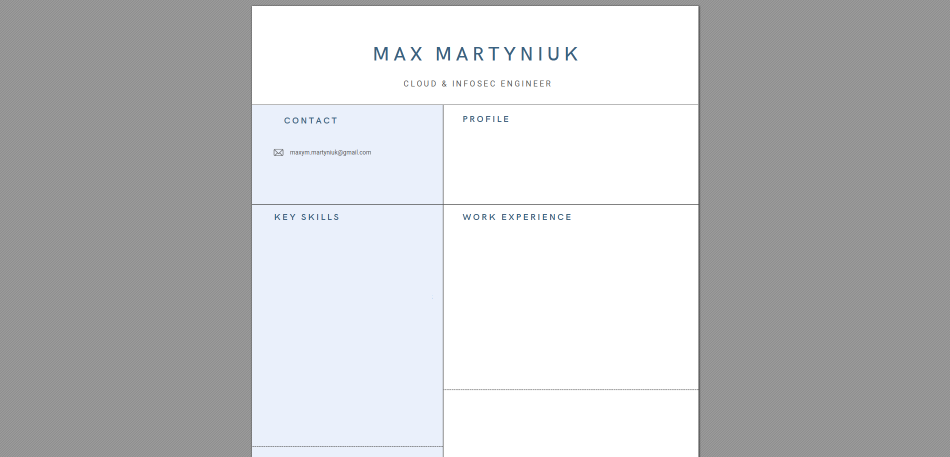

# Brief Functional Description
This application allows users to upload `.pdf` or `.html` files using a simple frontend. If the file is a `.pdf`, the `TriggerCloudConvertJob` Lambda function creates a job on the CloudConvert REST API to convert it into `.html`. When the `.html` file is uploaded to S3, it triggers the `createWebSite` Lambda function, which creates a randomly named S3 bucket, moves the `index.html` file to the new bucket, and sets up static website hosting. The website URL is sent to the frontend for display.

---

## Service 1: Frontend

The frontend provides an interface for users to upload PDF files to the S3 bucket (`conversion-service-bucket`). It also supports `.html` uploads for testing.

### Frontend Files
- **`conversion-frontend.html`**: User interface for file uploads.
- **`conversion-frontend.js`**: Handles file uploads to S3 and retrieves the website URL from the backend.

### Notes
- Hardcoded access credentials are temporarily used in JavaScript. Future updates will include **Cognito** and **pre-signed URLs** for security.
- Files uploaded to S3 require:
  - **PUT permissions** for the user accessing S3.
  - **Bucket policy** to allow public GET requests.
  - **CORS configuration** to enable all origins.

---

## Service 2: CloudConvert Job

When a `.pdf` file is uploaded, the **`TriggerCloudConvertJob`** Lambda function:
1. Extracts the S3 bucket and file key from the event.
2. Uses the CloudConvert REST API to:
   - Import the PDF file from S3.
   - Convert it to HTML.
   - Export the HTML file back to S3.

**`TriggerCloudConvertJob`** Lambda code -- [TriggerCloudConvertJob](backend/TriggerCloudConvertJob.py)

### Environment Variables
- `CLOUDCONVERT_API_KEY`: CloudConvert API key.
- `ACCESS_KEY_ID`: AWS access key.
- `SECRET_ACCESS_KEY`: AWS secret access key.

### Permissions
The **`TriggerCloudConvertJob`** Lambda requires:
- **s3:GetObject**, **s3:PutObject** for `conversion-service-bucket`.

---

## Service 3: Static Website Creation

When an `.html` file (`index.html`) is uploaded, the **`createWebSite`** Lambda function:
1. Extracts details of the uploaded file and source bucket.
2. Generates a random name for a new S3 bucket.
3. Creates the new S3 bucket and enables static website hosting.
4. Moves the `index.html` file to the new bucket.
5. Configures public access and static website permissions.
6. Constructs the website URL and sends it to the `file-processing-logs` SQS queue.

**`createWebSite`** Lambda code -- [createWebSite](backend/createWebSite.py)

### Permissions
The **`createWebSite`** Lambda requires:
1. **sqs:SendMessage** for `file-processing-logs`.
2. **s3:GetObject**, **s3:DeleteObject** for `conversion-service-bucket`.
3. **s3:CreateBucket**, **s3:PutObject**, **s3:PutBucketWebsite**, **s3:PutBucketPolicy**, **s3:PutPublicAccessBlock** for the new S3 bucket.

---

## Service 4: URL processing

### Components
1. **`logProcessing` Lambda**: Fetches the website URL from the SQS queue.
2. **`logAPI` API Gateway**: Handles frontend requests for the website URL.

### Process
1. The frontend sends a GET request to the **API Gateway** (`logAPI`).
2. **API Gateway** triggers the **`logProcessing`** Lambda function.
3. **`logProcessing`** retrieves the URL from SQS and sends it back to the frontend.
4. Frontend shows the Button with the link to a new website.

**`logProcessing`** Lambda code -- [logProcessing](backend/logProcessing.py)

---

## Visual presentation
#### Starting page

---

#### File uploaded

---

#### API response in console with the link. Website button appeared

---

#### Final result. Website based on the uploaded file.

---

## Clean up Python script.

**`clean-up.py`**: Python script that is removing new S3 buckets and cleans up the main bucket while testing. Optionally can upload frontend files to empty S3 for fresh test.

